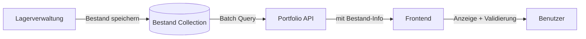

# Feature: Bestandsanzeige auf Produktseite

## Übersicht
Die Produktseite `/products` zeigt jetzt die **verfügbare Menge** jedes Produkts aus dem Lagerbestand an. Zusätzlich werden Produkte als "ausverkauft" markiert, wenn der Bestand 0 ist.

## Implementierte Änderungen

### 1. Backend: Portfolio-API erweitert (`portfolio.js`)

#### Neuer Import
```javascript
const Bestand = require('../models/Bestand');
```

#### GET `/api/portfolio/with-prices` - Erweiterte Funktion

**Optimierung:** Batch-Loading der Bestände
```javascript
// Alle Bestandsinformationen auf einmal laden (Performance-Optimierung)
const portfolioIds = portfolioItems.map(item => item._id);
const bestaende = await Bestand.find({ 
  typ: 'produkt',
  artikelId: { $in: portfolioIds }
}).lean();

// Bestand-Map erstellen für schnellen O(1) Zugriff
const bestandMap = new Map();
bestaende.forEach(b => {
  bestandMap.set(b.artikelId.toString(), {
    verfuegbareMenge: b.menge || 0,
    mindestbestand: b.mindestbestand || 0,
    aufLager: (b.menge || 0) > 0
  });
});
```

**Neues Response-Format:**
```json
{
  "success": true,
  "count": 10,
  "data": [
    {
      "_id": "...",
      "name": "Vanilla Dream",
      "preis": 8.50,
      "bestand": {
        "verfuegbareMenge": 15,
        "mindestbestand": 5,
        "aufLager": true
      },
      "bilder": { ... },
      "gramm": 100,
      "seife": "Sheabutter",
      "aroma": "Vanilla"
    }
  ]
}
```

### 2. Frontend: ProductsPage.js erweitert

#### Neue Bestandsanzeige unter dem Preis

**Desktop & Mobile:**
```jsx
{/* Verfügbarkeit */}
{product.bestand && (
  <Box sx={{ textAlign: 'center' }}>
    {product.bestand.aufLager ? (
      <Chip 
        label={`${product.bestand.verfuegbareMenge} Stück auf Lager`}
        size="small"
        color="success"
        variant="outlined"
      />
    ) : (
      <Chip 
        label="Aktuell nicht vorrätig"
        size="small"
        color="error"
        variant="outlined"
      />
    )}
  </Box>
)}
```

#### Erweiterte Bestandsprüfung beim Hinzufügen zum Warenkorb

**Validierung:**
```javascript
// Bestandsprüfung
if (product.bestand && !product.bestand.aufLager) {
  toast.error('Produkt ist aktuell nicht auf Lager');
  return;
}

const quantity = quantities[product._id] || 1;

// Prüfe ob genug auf Lager
if (product.bestand && quantity > product.bestand.verfuegbareMenge) {
  toast.error(`Nur ${product.bestand.verfuegbareMenge} Stück verfügbar`);
  return;
}
```

#### Button-Steuerung

**Mengen-Plus-Button:**
```jsx
<IconButton
  disabled={
    product.bestand && 
    product.bestand.aufLager && 
    quantities[product._id] >= product.bestand.verfuegbareMenge
  }
>
  <AddIcon />
</IconButton>
```

**Warenkorb-Button:**
```jsx
<Button
  disabled={product.bestand && !product.bestand.aufLager}
>
  {product.bestand && !product.bestand.aufLager ? 'Ausverkauft' : 'Warenkorb'}
</Button>
```

## Best Practices Implementiert

### ✅ **Performance-Optimierung**
- **Batch-Loading**: Alle Bestände werden mit einem einzigen DB-Query geladen
- **Map-Struktur**: O(1) Lookup-Zeit statt O(n) Array-Suche
- **Lean Queries**: Mongoose `.lean()` für schnellere Queries ohne Hydration

### ✅ **Datenkonsistenz**
- Bestand wird direkt aus der `Bestand`-Collection gelesen
- Fallback: Produkte ohne Bestand-Eintrag zeigen keine Verfügbarkeit an
- Synchronisation mit Lagerverwaltung garantiert

### ✅ **User Experience**
- **Klare visuelle Indikatoren**:
  - Grüner Chip = Auf Lager mit Mengenangabe
  - Roter Chip = Ausverkauft
- **Proaktive Fehlermeldungen**:
  - "Produkt ist aktuell nicht auf Lager"
  - "Nur X Stück verfügbar"
- **Disabled States**: Buttons werden deaktiviert wenn nicht verfügbar

### ✅ **Mobile-Optimierung**
- Kompakte Chip-Größe (`size="small"`)
- Responsive Text-Größen
- Touch-freundliche Button-Größen

### ✅ **Fehlerbehandlung**
- Graceful Degradation: Fehlende Bestandsinfo = keine Anzeige
- Try-Catch bei API-Calls
- Benutzerfreundliche Toast-Nachrichten

## Datenfluss



## API-Endpunkt

**URL:** `GET /api/portfolio/with-prices`

**Response-Schema:**
```typescript
{
  success: boolean;
  count: number;
  data: Array<{
    _id: string;
    name: string;
    preis: number;
    bestand?: {
      verfuegbareMenge: number;
      mindestbestand: number;
      aufLager: boolean;
    };
    bilder: { ... };
    // ... andere Portfolio-Felder
  }>;
}
```

## Testing-Checkliste

### ✅ Backend
- [ ] Portfolio-API liefert Bestandsinformationen
- [ ] Batch-Loading funktioniert mit mehreren Produkten
- [ ] Produkte ohne Bestand-Eintrag haben keine `bestand`-Property
- [ ] Performance: Query-Zeit < 100ms für 50 Produkte

### ✅ Frontend
- [ ] Bestandsanzeige erscheint unter dem Preis
- [ ] Grüner Chip bei verfügbaren Produkten
- [ ] Roter Chip bei ausverkauften Produkten
- [ ] Warenkorb-Button zeigt "Ausverkauft" bei Bestand = 0
- [ ] Plus-Button deaktiviert bei max. Bestand erreicht
- [ ] Toast-Nachricht bei Überschreitung der Verfügbarkeit
- [ ] Mobile-Ansicht sieht gut aus

### ✅ Integration
- [ ] Bestand aus Lagerverwaltung wird korrekt angezeigt
- [ ] Korrektur im Lager aktualisiert Produktseite
- [ ] Produktion erhöht verfügbare Menge
- [ ] Ausverkaufte Produkte können nicht in Warenkorb

## Zukünftige Erweiterungen (Optional)

### 1. **Echtzeit-Updates**
- WebSocket-Integration für Live-Bestandsupdates
- Benachrichtigung wenn Produkt wieder verfügbar

### 2. **Intelligente Empfehlungen**
- "Ähnliche Produkte" bei ausverkauften Artikeln
- "Benachrichtigen Sie mich" Button

### 3. **Erweiterte Anzeige**
- Lieferzeit-Schätzung bei niedrigem Bestand
- "Nur noch X Stück" Warnung ab Mindestbestand
- Lagerstandsverlauf (Chart)

### 4. **Admin-Features**
- Bulk-Bestandsupdate
- Import/Export von Beständen
- Automatische Nachbestellung

## Datenbankstruktur

**Bestand Collection:**
```javascript
{
  _id: ObjectId,
  typ: 'produkt',
  artikelId: ObjectId,  // Referenz zu Portfolio._id
  menge: Number,        // Verfügbare Menge
  einheit: 'Stück',
  mindestbestand: Number,
  letzteAenderung: {
    datum: Date,
    grund: String,
    menge: Number
  },
  notizen: String
}
```

## Migrations-Hinweise

### Für bestehende Produkte ohne Bestand:
1. Lager öffnen → Tab "Fertigprodukte"
2. Für jedes Produkt Inventur durchführen
3. Gezählte Menge eintragen
4. Mindestbestand festlegen

### Oder via Script:
```javascript
// Alle Portfolio-Produkte durchgehen und Bestand erstellen
const portfolioProdukte = await Portfolio.find({ aktiv: true });
for (const produkt of portfolioProdukte) {
  await Bestand.findeOderErstelle('produkt', produkt._id, 'Stück');
}
```

## Changelog

### Version 1.0 - Bestandsanzeige (2025-10-06)
- ✅ Backend: Bestand-Integration in Portfolio-API
- ✅ Frontend: Verfügbarkeitsanzeige mit Chips
- ✅ Validation: Bestandsprüfung beim Warenkorb
- ✅ UX: Disabled States für ausverkaufte Produkte
- ✅ Performance: Batch-Loading für Bestände

---

**Entwickelt für:** Glücksmomente E-Commerce  
**Datum:** 6. Oktober 2025  
**Framework:** Node.js + Express + React + Material-UI
